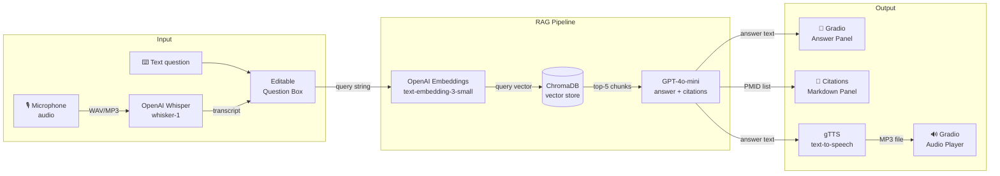

# MedVoiceRAG

> **Voice-driven RAG assistant for Q&A over neuroimmunology / multiple sclerosis literature — with grounded, cited answers and spoken responses.**

**Repository:** https://github.com/aliminagar/MedVoiceRAG

---

## Overview

MedVoiceRAG is a retrieval-augmented generation (RAG) system that lets you ask questions — by voice or by text — about multiple sclerosis and neuroimmunology research, and receive answers that are:

- **Grounded** in real PubMed abstracts (no hallucination beyond retrieved context)
- **Cited** with inline PMID references and clickable PubMed links
- **Spoken aloud** via text-to-speech so you can listen while you read

The pipeline ingests PubMed abstracts, chunks and embeds them into a ChromaDB vector store, and at query time retrieves the top-5 most relevant chunks before generating an answer with GPT-4o-mini. A Gradio web UI ties voice input, text input, and audio output together in a single interface.

---

## Features

| Feature | Detail |
|---|---|
| 🎙️ Voice input | Records audio from your microphone; transcribed by **OpenAI Whisper** (`whisper-1`) |
| ⌨️ Text input | Type a question directly — editable after transcription |
| 🔍 Semantic retrieval | **ChromaDB** + **OpenAI `text-embedding-3-small`** embeddings over 676 PubMed abstracts (~1,794 chunks) |
| 📄 Grounded answers | **GPT-4o-mini** generates answers using only retrieved context; every claim links to a PMID |
| 🔗 Clickable citations | Citations rendered as a Markdown list with PubMed hyperlinks (title · journal · year) |
| 🔊 Spoken answers | **gTTS** converts the answer to an MP3; played inline in the Gradio audio widget |
| 🖥️ Web UI | **Gradio** interface — no frontend code required |
| 📊 Rigorous evaluation | **RAGAS** faithfulness + answer-relevancy metrics over a 10-question neuroimmunology test set |

---

## Architecture



### Component Notes

| Component | File | Role |
|---|---|---|
| PubMed fetcher | `src/ingest/fetch_pubmed.py` | Downloads abstracts via Biopython Entrez; saves to JSONL |
| Index builder | `src/ingest/build_index.py` | Chunks text, embeds with OpenAI, indexes into ChromaDB |
| RAG pipeline | `src/rag/pipeline.py` | Retrieves top-5 chunks, calls GPT-4o-mini, formats citations |
| Transcription | `src/audio/transcribe.py` | Sends audio file to Whisper API; returns transcript string |
| Speech synthesis | `src/audio/speak.py` | Converts text to MP3 via gTTS; returns temp file path |
| Gradio UI | `src/app.py` | Wires microphone → transcribe → question box → pipeline → display + audio |
| Evaluator | `src/eval/evaluate.py` | Runs RAGAS faithfulness + answer-relevancy over curated test set |

---

## Tech Stack

| Layer | Technology |
|---|---|
| Language & packaging | Python 3.12 · Poetry |
| LLM orchestration | LangChain · LangChain-OpenAI |
| Language model | OpenAI GPT-4o-mini |
| Embeddings | OpenAI `text-embedding-3-small` |
| Speech-to-text | OpenAI Whisper (`whisper-1`) |
| Text-to-speech | gTTS (Google Text-to-Speech) |
| Vector store | ChromaDB |
| PubMed ingestion | Biopython (`Bio.Entrez`) |
| Web UI | Gradio |
| Evaluation | RAGAS 0.4.x |

---

## Project Structure

```
medvoice-rag/
├── src/
│   ├── app.py                  # Gradio web UI
│   ├── audio/
│   │   ├── transcribe.py       # Whisper speech-to-text
│   │   └── speak.py            # gTTS text-to-speech
│   ├── ingest/
│   │   ├── fetch_pubmed.py     # PubMed abstract downloader
│   │   └── build_index.py      # Chunk → embed → ChromaDB indexer
│   ├── rag/
│   │   └── pipeline.py         # Retrieval + generation + citations
│   └── eval/
│       ├── evaluate.py         # RAGAS evaluation script
│       ├── results.json        # Per-question scores (generated)
│       └── results.md          # Markdown summary table (generated)
├── data/
│   └── abstracts.jsonl         # Downloaded PubMed abstracts
├── chroma_db/                  # Persisted ChromaDB vector index
├── docs/
│   └── images/                 # UI screenshots (see Usage section)
├── tests/
├── .env.example                # Environment variable template
├── pyproject.toml              # Poetry dependencies
└── README.md
```

---

## Data Pipeline

Abstracts are fetched from PubMed using the **Biopython Entrez API** (configurable author and topic query), saved as JSONL, chunked, embedded, and indexed.

```
PubMed API
    │  (Biopython Entrez)
    ▼
data/abstracts.jsonl          676 abstracts · title + abstract text
    │  (RecursiveCharacterTextSplitter, 800 chars / 200 overlap)
    ▼
~1,794 text chunks
    │  (OpenAI text-embedding-3-small)
    ▼
ChromaDB vector index         persisted to ./chroma_db/
```

The fetch query is fully configurable — edit the `SEARCH_QUERY` constant in `fetch_pubmed.py` to target any author, topic, or MeSH term.

---

## Evaluation (RAGAS)

Faithfulness and Answer Relevancy were computed with **RAGAS 0.4.x** over a 10-question neuroimmunology / MS test set. No reference answers were required — both metrics are reference-free.

- **Faithfulness** measures whether every claim in the answer is supported by the retrieved contexts (1.0 = fully grounded).
- **Answer Relevancy** measures how well the answer addresses the question (higher = more on-topic).

| # | Question | Faithfulness | Answer Relevancy |
|---|----------|:---:|:---:|
| 1 | Role of natalizumab in MS | 1.00 | 0.67 |
| 2 | B-cell depletion (ocrelizumab) | 1.00 | 0.96 |
| 3 | Mechanisms of neuroinflammation | 1.00 | 1.00 |
| 4 | Cytokines in MS pathogenesis | 0.80 | 0.96 |
| 5 | Myelin repair after demyelination | 1.00 | 0.96 |
| 6 | Imaging biomarkers for MS activity | 1.00 | 0.70 |
| 7 | Gut microbiota influence on MS | 1.00 | 0.98 |
| 8 | Long-term safety of alemtuzumab | 1.00 | 1.00 |
| 9 | Th17 cells in neuroautoimmunity | 1.00 | 0.82 |
| 10 | Latest remyelination therapies | 1.00 | 0.97 |
| | **AVERAGE** | **0.98** | **0.90** |

> Computed with RAGAS over a 10-question neuroimmunology test set; no reference answers required.

**Interpretation:** A faithfulness score of 0.98 means the pipeline almost never asserts claims outside its retrieved evidence — a strong signal of groundedness. The two lower answer-relevancy scores (natalizumab: 0.67, imaging biomarkers: 0.70) indicate those answers were slightly broader than the question strictly required, likely because multiple related mechanisms appear in the retrieved context.

---

## Setup & Installation

### Prerequisites

- Python 3.12
- [Poetry](https://python-poetry.org/docs/#installation)
- OpenAI API key

### Steps

```bash
# 1. Clone the repository
git clone https://github.com/aliminagar/MedVoiceRAG.git
cd MedVoiceRAG

# 2. Copy the environment template and add your OpenAI API key
cp .env.example .env
# Edit .env and set:  OPENAI_API_KEY=sk-...

# 3. Install dependencies
poetry install

# 4. Fetch PubMed abstracts  (~676 abstracts, takes ~1 min)
poetry run python -m src.ingest.fetch_pubmed

# 5. Build the ChromaDB vector index  (~1,794 chunks, takes ~2–3 min)
poetry run python -m src.ingest.build_index

# 6. Launch the Gradio UI
poetry run python src/app.py
# → Open http://127.0.0.1:7860 in your browser
```

### Environment Variables

| Variable | Description |
|---|---|
| `OPENAI_API_KEY` | Your OpenAI API key (required) |

---

## Usage

1. **Voice question** — click the microphone button, speak your question, and release. The transcript will appear in the question box (editable).
2. **Text question** — type directly into the question box.
3. **Submit** — click **Submit**. Within a few seconds you will see:
   - The generated answer in the **Answer** panel
   - A formatted citation list with clickable PubMed links in the **Citations** panel
   - The spoken answer ready to play in the **Audio** player
4. **Run evaluation** — to reproduce the RAGAS scores:
   ```bash
   poetry run python src/eval/evaluate.py
   # Results saved to src/eval/results.json and src/eval/results.md
   ```

---

## Screenshots

| Main UI | Answer with Citations | Voice Input |
|:---:|:---:|:---:|
|  |  |  |

> Screenshots are illustrative — launch the app locally to see the live interface.

---

## Author

**Alireza Minagar** — AI/ML Software Engineer

- 🐙 GitHub: [https://github.com/aliminagar](https://github.com/aliminagar)
- 📧 Email: [aminagar@gmail.com](mailto:aminagar@gmail.com)
- 🌐 Portfolio: [https://alirezaminagar-md.netlify.app](https://alirezaminagar-md.netlify.app)

---

## License

This project is licensed under the **MIT License** — see [LICENSE](LICENSE) for details.
